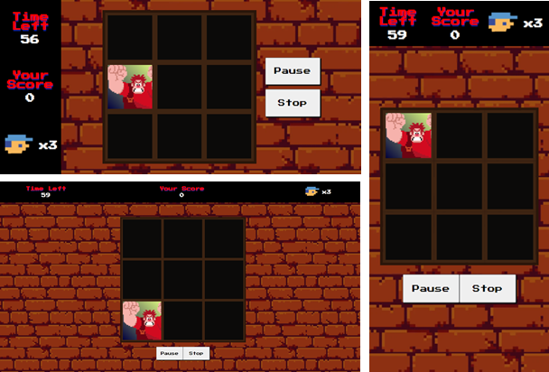

# Jogo Detona Ralph

Um simples jogo construído em HTML, CSS e Javascript puros.

Acerte o inimigo (Ralph) a maior quantidade de vezes possível em um intervalo de tempo pré-determinado e tentativas limitadas. Você pode pausar o jogo, retomar, encerrar e reiniciar se quiser.

Cada acerto gera um ponto que pode ser visualizado em tempo real no menu superior e o total de acertos ao final do jogo.
Cada erro decrementa o contador de vidas, que ao zerar encerra imediatamente o jogo e exibe seu score.

O jogo se adapta bem a diferentes tamanhos de tela (dimensões mínimas: altura 320px e largura 450px).

 

## Configurações

O tempo inicial pode ser ajustado alterando o valor da propriedade `currentTime` do objeto `state` e reatribuição na função `stopGame()`*.

A velocidade do jogo pode ser ajustada alterando o valor da propriedade gameVelocity no objeto `state`.

A quantidade de tentativas pode ser alterada modificando o valor da propriedade `livesCounter` do objeto `state` e reatribuição na função `stopGame()`*.

-----
*Reatribuição necessária para o reinício do jogo, uma vez que decrementos são realizados diretamente na referida propriedade.

